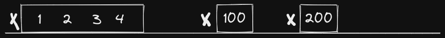

# Longest Consecutive Sequence

  [Problem Link](https://leetcode.com/problems/longest-consecutive-sequence/)

## Approaches and Solution insights

### General Insight/Approach

I think the most important trigger for this question was the phrase "_longest consecutive elements_". Specifically, the word _longest_ makes me think that we would need to enumerate through all possible entities (which, in this particular problem are sequences), compare them and determine which is longest since no clear heuristic exists.

Additionally, because we are limited to a set of elements within an array, our scope of enumeration reduced drastically as we only need to generate entities (sequences) from the elements within the problem set.

### Problem Specific Insight/Approach

#### Solution 1: Sort & Search

One solution would be to sort the array first, that way we have our sequences lined up for us. We then iterate over the array ensuring that the difference between any two elements is equal to one, keeping track of the length of our sequence and the longest sequence thus far along the way.

This solution is fine but it is limited to the time complexity of the sorting algorithm which is typically log linear time `O(nlogn)`. We won't be able to optimize for shorter time. However, there is another way...

- **Time complexity**: `O(nlogn)`
- **Space Complexity**: `O(1)`

#### Solution 2: Linear iteration

If we were to draw out a number line for the following (sample) input `[100, 1, 200, 2, 4, 3]`, it would look something like this

If we wanted to solve this problem from a human perspective, we simply need to count each sequence on the above number line and pick the longest one: `[1, 2, 3, 4]`. Now how can we translate that into code? We would need a way to generate all possible sequences within the array, and to do that we would need a way to determine the number that begins the sequence. Notice the `x`s? From our number line diagram above, we discover that all the numbers that a sequence begins with have no number to their left. Meaning, there is no number that is one less than them in the array.

Alright, now we know how to determine the number that begins the sequence. We search the array for the numbers that do not have a direct predecessor, then we generate a _consecutive_ sequence starting from said number (we keep adding one). Unfortunately, performing such a search on an array is slow $$O(n)$$ so we will need to use a HashSet/Set instead for its constant ($$O(1)$$) search time.

Thus our solution becomes:

1. We iterate over the array
2. We keep track of the size of the current sequence and the size of the largest thus far
3. For each number we check whether it is to be the start of a sequence (if it has a direct predecessor)
4. If it does we skip generating a sequence from that number
5. If it does not, we generate a sequence from the number checking if the next number in the sequence exists within the original array through our set.
6. The sequence generation stops when the next of the sequence does not exist in the original array
7. After we compare the length of the sequence against the length of the longest sequence and assign accordingly
8. After iteration, we return the length of the longest sequence

- **Time complexity**: `O(n)`
- **Space Complexity**: `O(n)`: Since we create a HashSet of the same length as the input array
